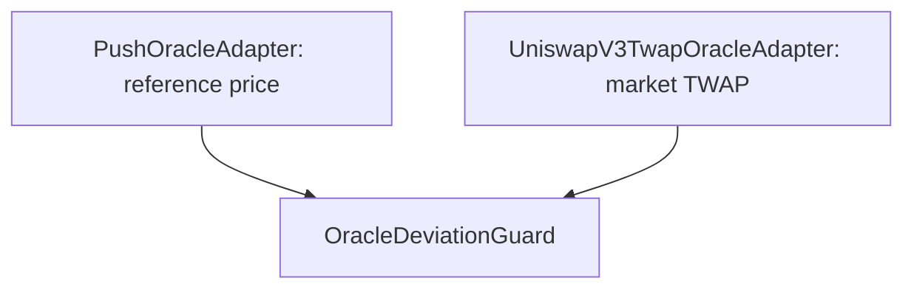

# Uniswap V3 TWAP Oracle Adapter

## Milestone summary

This milestone adds a Uniswap V3-style time-weighted average price adapter to the DeFi Protocol Lab. The adapter reads cumulative ticks from a pool, derives an arithmetic mean tick for a configured time window, converts that tick into a token quote, normalizes the quote to 18-decimal WAD precision, and returns the timestamp of the latest pool observation.

## Components

- `IUniswapV3PoolOracle` — minimal pool interface required by the adapter.
- `UniswapV3OracleMath` — mean-tick and tick-to-quote math.
- `UniswapV3TwapOracleAdapter` — pool validation, TWAP retrieval, quote normalization, and freshness validation.
- `MockUniswapV3Pool` — configurable test double for `observe`, `slot0`, and `observations`.
- `UniswapV3OracleMathHarness` — thin wrapper exposing library functions to Foundry tests.
- Unit tests for the math library and adapter.

## Core mental model

### Pool token order

Uniswap fixes token order by numerical address value:

```text
token0 = lower address
token1 = higher address
```

Names, symbols, and decimals do not determine this order. For Ethereum Mainnet WETH/USDC:

```text
USDC address < WETH address
token0 = USDC
token1 = WETH
```

The pool price is always encoded in the canonical direction:

```text
token1 / token0 = 1.0001^tick
```

The adapter may expose either direction. If the requested base token is `token0`, the quote uses the direct price. If the requested base token is `token1`, the quote uses the inverse price.

### Tick and raw price

A tick represents an exponential raw-unit ratio:

```text
rawPrice = 1.0001^tick
```

For tokens with equal decimals:

```text
tick 0     -> token1/token0 = 1
tick 6931  -> token1/token0 ~ 2
tick -6931 -> token1/token0 ~ 0.5
```

Token decimals are part of the raw ratio. For a pool where:

```text
token0 = USDC, 6 decimals
token1 = WETH, 18 decimals
human price = 2,000 USDC per WETH
```

the pool encodes:

```text
WETH_raw / USDC_raw
= (1 / 2,000) * 10^(18 - 6)
= 500,000,000
```

Therefore:

```text
tick = ln(500,000,000) / ln(1.0001)
     ~ 200,311
```

For approximately 3,000 USDC per WETH:

```text
tick ~ 196,256
```

The tick decreases as the human WETH price increases because the pool stores the inverse human direction, `WETH/USDC`.

### TWAP from cumulative ticks

The pool does not need to expose a separately stored TWAP price. The adapter obtains two cumulative tick values:

```text
observe([twapWindow, 0])
    -> cumulative tick at the start of the window
    -> cumulative tick now
```

The mean tick is:

```text
tickCumulativeDelta = cumulativeNow - cumulativePast
meanTick = floor(tickCumulativeDelta / twapWindow)
```

Example:

```text
past cumulative = 100,000
now cumulative  = 103,600
window          = 1,800 seconds

delta    = 3,600
meanTick = 2
```

Solidity signed division truncates toward zero, so an inexact negative result needs an explicit correction to mathematical floor:

```text
-3,601 / 1,800
Solidity truncation = -2
required floor      = -3
```

The math library owns this rounding rule and validates that the result is within the supported Uniswap tick range.

## Adapter pipeline

```text
latest pool observation
    -> validate initialized flag
    -> calculate observation age
    -> enforce staleness limit
    -> observe([twapWindow, 0])
    -> cumulative tick delta
    -> arithmetic mean tick
    -> quote one whole base token
    -> normalize quote decimals to WAD
    -> reject a zero rounded price
    -> return (priceWad, updatedAt)
```

The base amount is one complete base token in raw units:

```solidity
uint128 baseAmount = uint128(10 ** uint256(baseTokenDecimals));
```

The quote is then normalized from `quoteTokenDecimals` to 18 decimals using floor rounding.

For a WETH/USDC adapter:

```text
base amount  = 1e18 WETH raw units
quote amount = USDC raw units
USDC decimals: 6 -> WAD decimals: 18
```

## Constructor guarantees

The constructor rejects:

- a zero pool address;
- a zero base-token address;
- a zero quote-token address;
- identical base and quote tokens;
- empty or identical pair identifiers;
- a zero TWAP window;
- a zero observation-staleness limit;
- a requested token pair that does not match the pool in either direction;
- base or quote tokens with more than 18 decimals.

Both valid pair directions are supported:

```text
pool token0 -> pool token1
pool token1 -> pool token0
```

## Runtime guarantees

`latestPrice()` rejects:

- an uninitialized latest observation;
- an observation older than the configured limit;
- a mean tick outside the supported Uniswap tick range, propagated from `UniswapV3OracleMath`;
- a quote that becomes zero after integer arithmetic and decimal normalization.

The exact staleness boundary remains valid:

```text
age == maxObservationStaleness -> accepted
age >  maxObservationStaleness -> reverted
```

## Timestamp wraparound

Uniswap V3 stores observation timestamps as `uint32`. They wrap approximately every 136 years. Age calculation therefore intentionally uses modular `uint32` arithmetic:

```solidity
unchecked {
    observationAge = uint32(block.timestamp) - observationTimestamp;
}
```

The adapter reconstructs the full timestamp as:

```text
updatedAt = block.timestamp - observationAge
```

The stale-price error should report this reconstructed `updatedAt`, not the truncated `uint32 observationTimestamp`.

## Mock design

`MockUniswapV3Pool` is a test double, not a partial AMM implementation. It does not model swaps, liquidity, spot price, or the full observation ring buffer.

Tests configure only the adapter-facing boundary:

- pool token addresses;
- expected TWAP window;
- past and current cumulative ticks;
- latest observation index;
- latest observation timestamp;
- initialized state.

The mock should revert when the observe result was not configured. Otherwise, Solidity's default zero values would silently represent tick zero and produce a valid-looking price.

## Important testing lessons

### Test the production library, not copied logic

The harness must only delegate to `UniswapV3OracleMath`. Copying production math into a harness tests the duplicate rather than the real implementation.

### Error selectors do not identify the declaring contract

Errors with the same signature have the same selector:

```text
SomeContract.InvalidMeanTick(int56)
OtherContract.InvalidMeanTick(int56)
```

An adapter test originally appeared to cover an adapter-level tick guard, but LCOV showed that the math library reverted first. The adapter guard was dead code and was removed. Tests now expect `UniswapV3OracleMath.InvalidMeanTick` to document the actual error source.

### Use LCOV records to resolve the final coverage gap

Aggregate percentages identify that coverage is missing, but not why. The decisive records were:

```text
BRDA:<line>,..., -  -> branch never taken
DA:<line>,0         -> line never executed
```

They exposed the unreachable duplicate mean-tick guard. The correct resolution was removing dead code, not manufacturing an artificial test.

### Test pair validation combinations

Pair validation uses short-circuit boolean expressions. Tests include:

- successful direct order;
- successful inverse order;
- complete mismatch;
- partial direct-pair match followed by mismatch.

### Use a valid ABI value for excess decimals

OpenZeppelin's `ERC20ExcessDecimalsMock` returns `type(uint256).max`. Calling it through `IERC20Metadata.decimals() returns (uint8)` fails during ABI decoding before the adapter can execute its own validation.

A dedicated mock returning `uint8(19)` is the correct boundary test:

```text
18 decimals -> supported
19 decimals -> UnsupportedTokenDecimals
```

## Test coverage checklist

### Deployment

- successful inverse pool order;
- successful direct pool order;
- zero pool/base/quote addresses;
- identical tokens;
- zero or identical identifiers;
- zero TWAP window;
- zero staleness limit;
- complete and partial pool-pair mismatches;
- unsupported base-token decimals;
- unsupported quote-token decimals.

### Price retrieval

- deterministic tick and WAD normalization;
- realistic WETH/USDC price near 2,000;
- returned observation timestamp;
- observation exactly at the freshness boundary;
- uninitialized observation;
- stale observation;
- missing mock configuration;
- mean tick below minimum;
- mean tick above maximum;
- zero rounded price;
- `uint32` timestamp wraparound.

### Math library

- exact positive division;
- inexact positive division;
- exact negative division;
- inexact negative division with floor correction;
- minimum and maximum tick validation;
- tick-zero quote;
- direct and inverse quote directions;
- both `sqrtPriceX96` calculation branches.

## Security and integration considerations

- A TWAP reduces sensitivity to a single-block spot-price manipulation, but it is not manipulation-proof. Window length, pool liquidity, and economic attack cost remain critical.
- Observation freshness and TWAP window are separate controls. A long window does not prove that the pool has written a recent observation.
- The pool address must be trusted or validated by deployment configuration; pair matching alone does not prove canonical factory provenance, fee tier, or sufficient liquidity.
- The adapter reports a market-derived source. A production protocol should define how it behaves when this source diverges from a reference oracle.
- Integer rounding is intentional. Extremely small quotes may round to zero and must be rejected.
- Token metadata calls happen during construction. Tokens with malformed or incompatible `decimals()` implementations cannot be supported by this adapter.

## Milestone completion criteria

- Adapter implements `IPriceOracle`.
- Direct and inverse pool token order are supported.
- Cumulative-tick TWAP calculation is integrated.
- Quote amounts are normalized to WAD.
- Observation initialization, freshness, and timestamp wraparound are handled.
- Invalid pairs, decimals, ticks, and zero prices are rejected.
- Mock fails loudly when observation data is not configured.
- Adapter coverage is 100% for lines, statements, branches, and functions.

## Next checkpoint

Integrate the completed oracle primitives:



The first integration tests should cover:

- both sources around 2,000 USD and within the configured deviation;
- TWAP outside the allowed deviation;
- exact deviation boundary;
- stale or reverting underlying oracle behavior;
- direction and identifier compatibility between the two sources.

This checkpoint should clarify whether the existing `OracleDeviationGuard` API can compose the two adapters directly or whether a small orchestration component is required.
